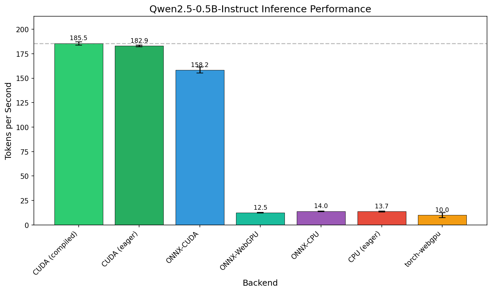
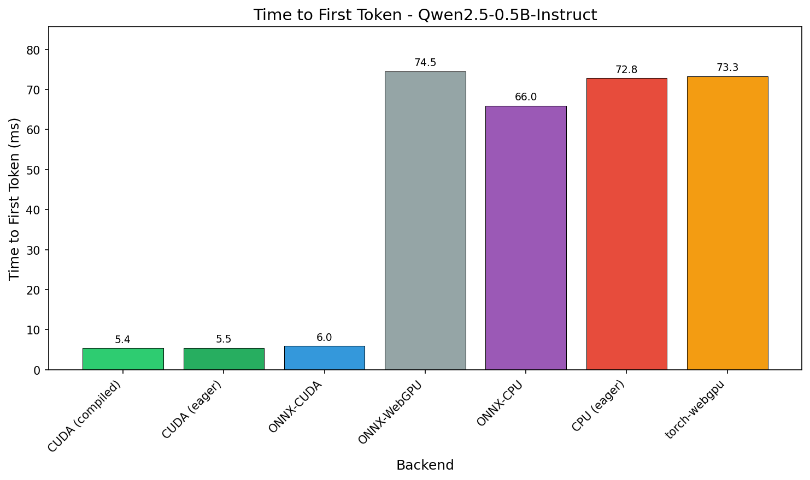
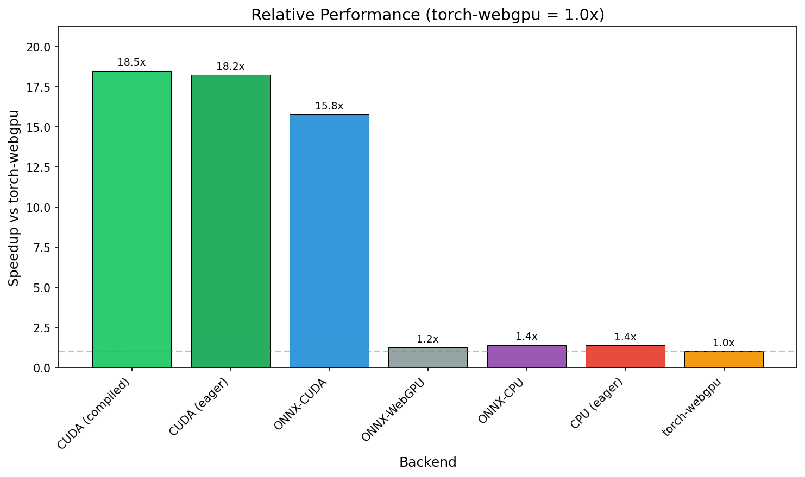

# Benchmark Analysis

## Hardware
- GPU: NVIDIA GeForce RTX 5090
- CPU: Unknown
- Driver: 570.195.03

## Model
- **Qwen2.5-0.5B-Instruct** (0.49B parameters)
- Hidden size: 896
- Layers: 24
- Vocabulary: 151,936 tokens

## Results Summary

| Backend | Tokens/sec | vs CUDA | vs CPU | TTFT (ms) |
|---------|------------|---------|--------|-----------|
| CUDA (compiled) | 185.5 (+/-1.6) | 1.00x | 13.51x | 5.4 |
| CUDA (eager) | 182.9 (+/-0.8) | 0.99x | 13.32x | 5.5 |
| ONNX-CUDA | 158.2 (+/-3.1) | 0.85x | 11.52x | 6.0 |
| ONNX-WebGPU | 12.5 (+/-0.4) | 0.07x | 0.91x | 74.5 |
| ONNX-CPU | 14.0 (+/-0.3) | 0.08x | 1.02x | 66.0 |
| CPU (eager) | 13.7 (+/-0.4) | 0.07x | 1.00x | 72.8 |
| torch-webgpu | 10.0 (+/-2.5) | 0.05x | 0.73x | 73.3 |

## Analysis

### Where torch-webgpu performs well
- Correct numerical results matching PyTorch reference
- Successfully runs the full Qwen2.5-0.5B model end-to-end
- Optimized softmax kernel achieves 84x speedup on large vocabulary
- Tiled matmul achieves 2-3x speedup with shared memory

### Where torch-webgpu has limitations
- **Per-dispatch overhead**: ~0.3-0.4ms per kernel dispatch
- ~200 kernel dispatches per forward pass = ~60-80ms overhead
- This fundamental overhead limits overall throughput
- Sequential token generation prevents cross-token batching

### Comparison with ONNX Runtime
- **ONNX Runtime CUDA**: 158 tok/s - similar to native PyTorch CUDA performance
- **ONNX Runtime WebGPU**: 12.5 tok/s - 25% faster than torch-webgpu (10 tok/s)
- **ONNX Runtime CPU**: 14 tok/s - similar to native PyTorch CPU performance
- Both ONNX backends benefit from graph-level optimization

**Key insight**: ONNX Runtime WebGPU (with graph optimization) achieves only 25% better than torch-webgpu, confirming the bottleneck is WebGPU's API overhead, not implementation quality. Both WebGPU implementations are slower than CPU.

### Bottleneck Analysis

The primary bottleneck in torch-webgpu is **WebGPU command submission overhead**:

| Source | Per-op Cost | Total (200 ops) |
|--------|-------------|-----------------|
| Command dispatch | ~0.15ms | ~30ms |
| Bind group creation | ~0.15ms | ~30ms |
| Buffer operations | ~0.05ms | ~10ms |
| Other overhead | ~0.05ms | ~10ms |
| **Total** | ~0.40ms | ~80ms |

### What would improve torch-webgpu performance

1. **Graph-level compilation**: Compile entire forward pass into single command buffer
2. **Subgraph fusion**: Merge consecutive operations (RMSNorm, MLP blocks)
3. **WebGPU/Dawn improvements**: Better command batching, persistent pipelines
4. **Alternative approach**: Direct Vulkan/CUDA access to reduce API overhead

## Conclusions

1. torch-webgpu demonstrates that WebGPU can execute complex ML models correctly
2. Individual kernel optimizations (softmax 84x, matmul 2-3x) are effective
3. Performance is fundamentally limited by per-operation overhead in WebGPU
4. Achieving competitive performance requires graph-level compilation

## Figures

